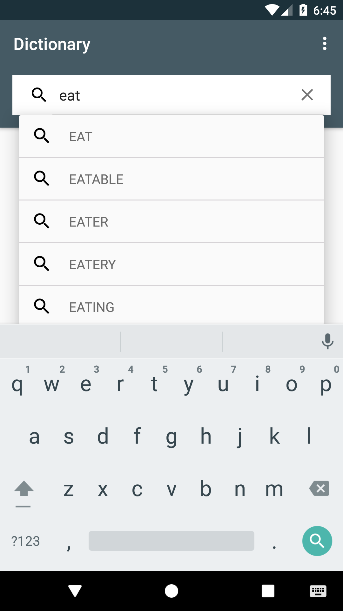
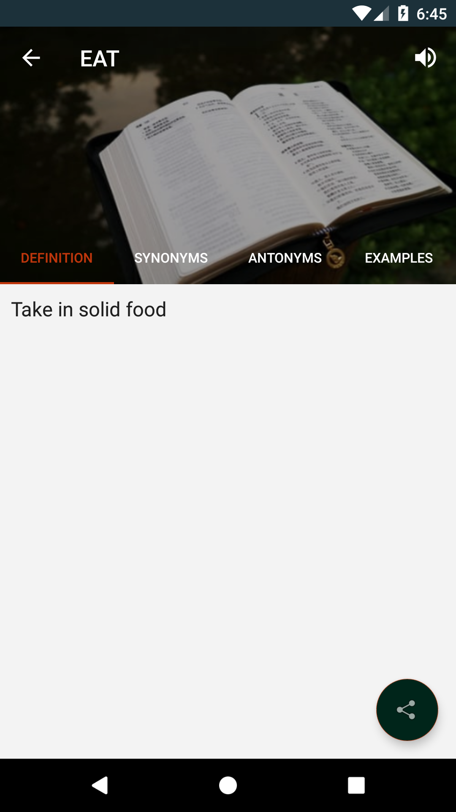
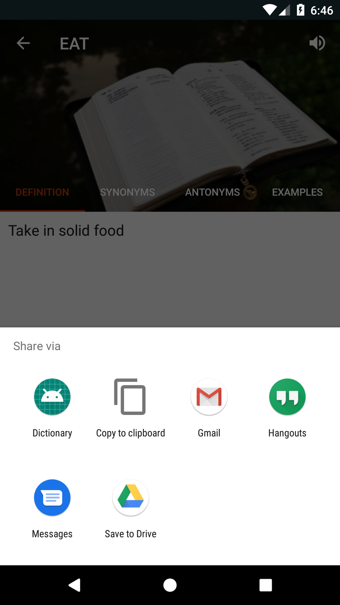
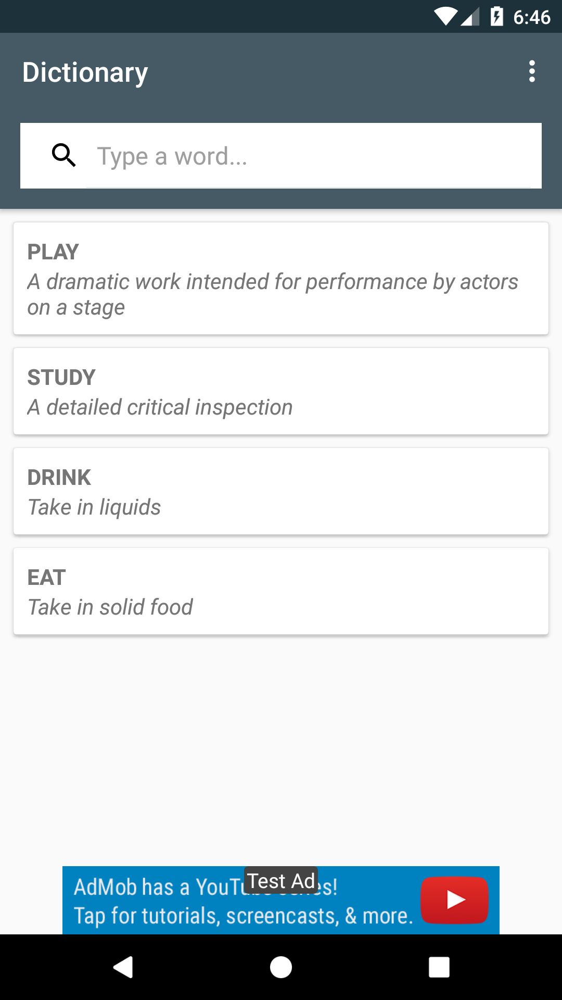

# Offline-Dictionary
Simple offline dictionary application including definition,synonyms,antonyms and examples of searched words.

**Third party libraries used:**
   
   * [Butterknife](https://github.com/JakeWharton/butterknife)
   * [Firebase](https://firebase.google.com/)

**Here are the screenshots:**

